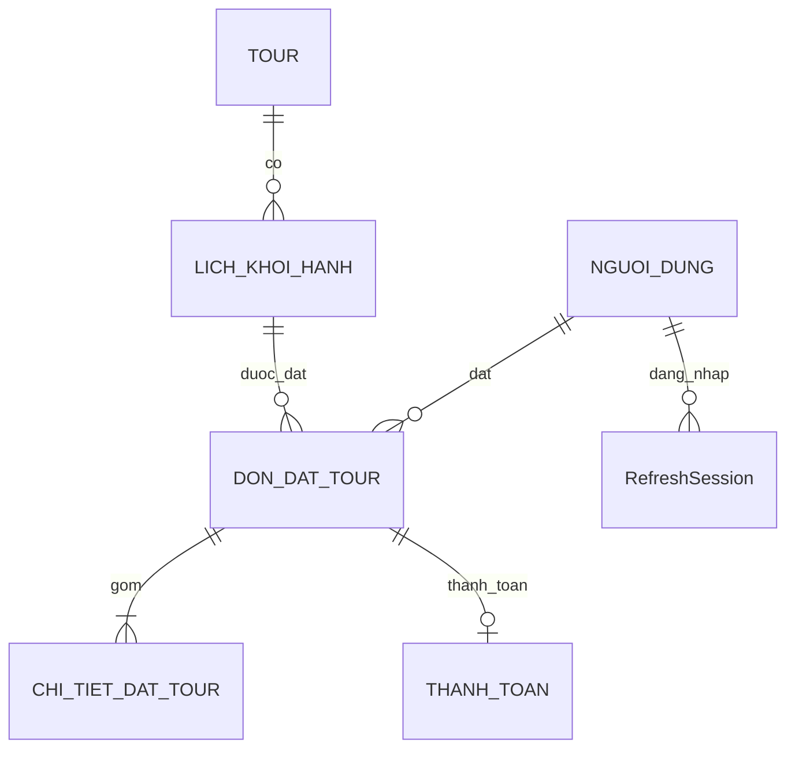

# Database schema

PostgreSQL là nguồn chuẩn cho giá, trạng thái, kho chỗ và thời gian quyết định. Redis không giữ bản chính của inventory. Prisma dùng tên model tiếng Anh trong code và `@@map` sang sáu tên thực thể SRS.

| SRS               | Prisma         | Trường và ràng buộc chính                                                                                                                |
| ----------------- | -------------- | ---------------------------------------------------------------------------------------------------------------------------------------- |
| NGUOI_DUNG        | User           | email unique và chuẩn hóa lowercase; passwordHash; role; isActive                                                                        |
| TOUR              | Tour           | slug unique; title, description, destination, durationDays; countryCode luôn VN; status; deletedAt                                       |
| LICH_KHOI_HANH    | Schedule       | tourId; departureAt timestamptz; totalSeats; reservedSeats; adultPrice/childPrice BIGINT; status                                         |
| DON_DAT_TOUR      | Booking        | userId, scheduleId; adults/children; totalAmount snapshot; tourTitle snapshot; expiresAt; status; contact; unique(userId,idempotencyKey) |
| CHI_TIET_DAT_TOUR | BookingDetail  | loại ADULT/CHILD, quantity, unitPrice snapshot, lineTotal; unique(bookingId,kind)                                                        |
| THANH_TOAN        | Payment        | bookingId unique; provider; providerReference unique; amount; status; unique(provider,transactionId)                                     |
| Bổ sung           | RefreshSession | hash token, userId, familyId, expiresAt, revokedAt                                                                                       |
| Bổ sung           | AuditLog       | actorId, action, entityId, metadata, createdAt                                                                                           |

`CHI_TIET_DAT_TOUR` lưu hai dòng giá theo loại khách, không tự suy diễn họ tên/ngày sinh từng hành khách từ SRS chưa được cung cấp. Không tạo loại INFANT.

## Kho chỗ

`availableSeats = totalSeats - reservedSeats`.

`reservedSeats` gồm số người ở đơn PENDING_PAYMENT chưa hết hạn và đơn PAID/CONFIRMED/COMPLETED. Khi hoàn thành tour, chỗ vẫn là chỗ đã được bán; chỉ hủy mới trả chỗ theo SRS. Lịch trong quá khứ không nhận đặt mới.

Tạo đơn: khóa lịch, thu hồi hold quá hạn, kiểm tra tour ACTIVE/lịch OPEN/thời gian, kiểm tra đủ chỗ, tăng reservedSeats và tạo Booking + Detail trong cùng transaction. Hủy: khóa cùng lịch, kiểm tra trạng thái/quyền, giảm reservedSeats và ghi CANCELLED trong cùng transaction. Trạng thái CANCELLED là điểm chặn replay; `seatsReleasedAt` là bằng chứng audit.

Tất cả writer phải theo thứ tự **Schedule trước, Booking/Payment sau**. Không đọc `availableSeats` bên ngoài transaction rồi cập nhật dựa trên giá trị cũ. Không đưa lệnh HTTP tới cổng thanh toán vào trong transaction.

## Ràng buộc DB ngoài Prisma

Prisma chưa biểu diễn đầy đủ CHECK trong schema này. Migration `202609160002_invariants` là thành phần bắt buộc:

- countryCode='VN'; durationDays 1..60.
- 0 <= reservedSeats <= totalSeats <= 10000.
- Giá nguyên VND, không âm, giới hạn ứng dụng công bố trong shared schema.
- adults >= 1, children >= 0.
- expiresAt = createdAt + interval '15 minutes'.
- CANCELLED tương đương seatsReleasedAt khác null.
- lineTotal = quantity * unitPrice.
- Tiền thanh toán/đơn trong giới hạn và currency='VND'.

Không chạy `prisma db push` để thay cho migrations: thao tác này không đại diện đầy đủ các CHECK đã khóa. Khi cần thay DB, Hồng Thắm dùng `npm run db:dev -w @tour/api -- --name ten_thay_doi`, review SQL rồi commit.

Foreign key Restrict bảo vệ lịch sử kinh doanh. User disable qua isActive; tour archive qua deletedAt. Chưa cung cấp CRUD user/admin role để tránh mở thêm phạm vi chưa có SRS. Tạo tài khoản nhân sự bằng seed/CLI quản trị có kiểm soát trong staging.

## Tiền và ngày giờ

Giá được nhập nguyên VND, do đó công thức đã nguyên và làm tròn VND không đổi kết quả. Nếu bổ sung phần trăm giảm giá/thuế, phải dùng decimal hoặc quy tắc rational rồi làm tròn đúng một lần, không dùng float tùy ý.

BIGINT trong DB, `bigint` trong backend; public DTO chuyển sang number sau giới hạn <=9.999.999.999 VND. Không JSON.stringify trực tiếp Prisma entity chứa bigint. Tất cả ngày giờ lưu UTC timestamptz(3), UI hiển thị giờ Việt Nam.

## Chỉ mục và khả năng mở rộng

Index status/expiresAt hỗ trợ sweep; scheduleId/status hỗ trợ reclaim dưới khóa; tourId/departureAt hỗ trợ lịch; userId/idempotencyKey chống tạo trùng. Tra cứu text hiện dùng contains insensitive, phù hợp đồ án. Dataset lớn cần full-text/trigram và keyset pagination sau khi đo, không cần thêm sớm.

One booking/one payment record là lựa chọn skeleton giúp khóa một provider. Nếu cần nhiều lần thử/cổng trên một đơn, thêm PaymentAttempt, đối soát và ràng buộc “một khoản thu được chấp nhận”, không xóa record cũ để né unique constraint.
