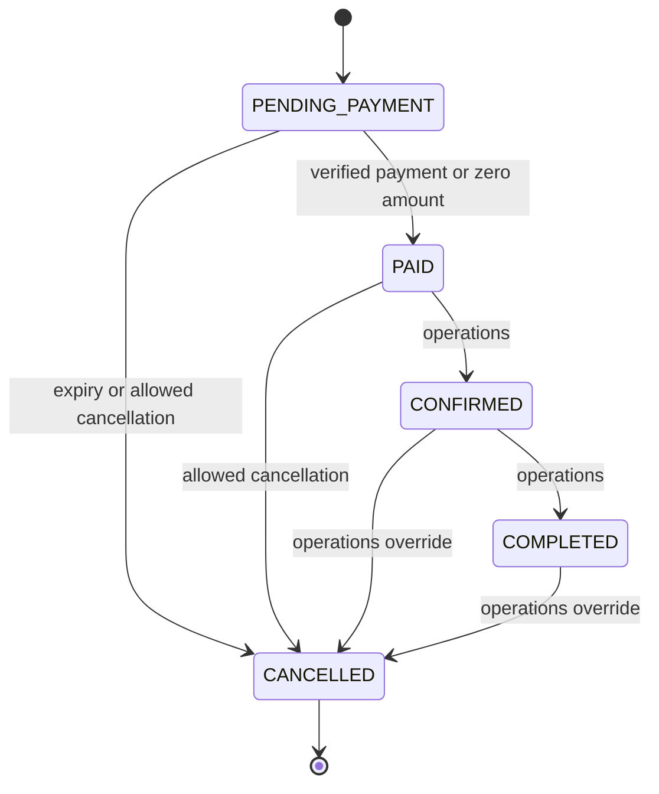

# Quyết định và điểm cần đối chiếu SRS

Phạm vi nguồn: chỉ phần SRS trong lời yêu cầu. Chưa có file SRS đầy đủ hay rubric chấm điểm. Những lựa chọn dưới đây được ghi rõ để tránh ngầm sửa tài liệu đã phê duyệt.

| Vấn đề                                                                           | Hành vi đã cài                                                                                                        | Căn cứ / việc cần xác nhận                                                                                                       |
| -------------------------------------------------------------------------------- | --------------------------------------------------------------------------------------------------------------------- | -------------------------------------------------------------------------------------------------------------------------------- |
| Sơ đồ nói mọi trạng thái có thể hủy, nhưng điều kiện hủy giới hạn hai trạng thái | Khách chỉ PENDING_PAYMENT/PAID và >=72h; SYSTEM hủy hold hết hạn; ADMIN/OPERATIONS hủy mọi trạng thái với lý do/audit | Cách giải nghĩa để giữ cả hai đoạn SRS. Leader xác nhận quyền override, đặc biệt COMPLETED, với giảng viên                       |
| 15 phút “đúng”                                                                   | Deadline DB đúng 900000ms, từ chối payment tại/sau deadline; job nền có thể chạy trễ, sweep 5s và reclaim khi đọc/ghi | Không hứa CPU sẽ thực thi chính xác tới millisecond lúc server/Redis ngừng                                                       |
| Webhook đến sau deadline                                                         | Không khôi phục đơn, ghi REFUND_REQUIRED                                                                              | Dùng thời gian xử lý DB sau khóa. Nếu muốn xét thời điểm thanh toán tại cổng phải thiết kế giữ chỗ/đối soát khác và review riêng |
| Hoàn chỗ                                                                         | Mỗi người lớn/trẻ em chiếm 1 chỗ; mọi lần hủy hợp lệ trả chỗ đúng một lần                                             | Đúng SRS, giữ trong một transaction                                                                                              |
| Đơn miễn phí                                                                     | Total=0 vẫn phải qua bước xác nhận /payments, ghi payment SUCCEEDED và PAID nội bộ, không gọi cổng                    | SRS cho phép tiền không âm, cổng thực tế có mức tối thiểu; audit ZERO_AMOUNT_PAYMENT                                             |
| Giá VND                                                                          | Chỉ nhận giá nguyên VND, BigInt khi nhân/cộng                                                                         | Không có thuế/phí/discount trong trích đoạn nên không tự thêm                                                                    |
| Khởi hành gần                                                                    | Không tạo hold nếu chỉ còn <=15 phút tới giờ đi                                                                       | Quy tắc kỹ thuật để không giữ chỗ vượt giờ đi; cần đối chiếu nếu SRS có last-minute booking                                      |
| Thay ngày lịch                                                                   | Không hỗ trợ thay departureAt trên PATCH                                                                              | Tránh thay ngày khiến điều kiện 72h của đơn cũ biến động; cần luồng đổi chuyến riêng                                             |
| Payment retries                                                                  | Một payment/provider cố định cho một booking, stable reference khi retry tạo checkout                                 | Chưa có PaymentAttempt đa cổng. Nếu gateway tạo được mà response bị mất, cần đối soát trước khi phát hành giao dịch khác         |
| Hoàn tiền                                                                        | Đánh dấu cần hoàn; admin nhập bằng chứng sau khi hoàn thủ công ở merchant portal                                      | SRS chưa quy định phí và công thức hoàn; không tuyên bố tự động refund                                                           |
| Chi tiết đặt tour                                                                | Dòng người lớn/trẻ em và snapshot giá, chưa danh sách họ tên từng người                                               | Chỉ thêm passenger entity nếu toàn văn SRS yêu cầu                                                                               |
| Hoàn thành đơn                                                                   | Chỉ CONFIRMED -> COMPLETED, không trước departureAt                                                                   | SRS chưa chỉ rõ mốc kết thúc. Nếu có endAt, bổ sung ràng buộc theo đó                                                            |
| Giới hạn input                                                                   | Tối đa 100 NL, 100 TE; giá <=99.999.999/người, tổng <=9.999.999.999                                                   | Giới hạn kỹ thuật minh bạch trong shared schema, không tự suy diễn phân loại tuổi trẻ em                                         |
| Thống kê                                                                         | Cache 15s, không dùng số liệu này cho inventory hay thanh toán                                                        | Inventory luôn đọc DB                                                                                                            |
| Chatbot                                                                          | Truy xuất dữ liệu và hướng dẫn thao tác; không tự thanh toán/hủy/sửa DB                                               | AI không phải nguồn cấp quyền; tác vụ thay đổi phải qua màn hình xác nhận và API thường                                          |

## Máy trạng thái

Một webhook thất bại chỉ đổi Payment, không tự hủy Booking ngay; hold vẫn hết sau 15 phút. Booking đã PAID không hết hạn bởi job cũ. Hủy tour bằng soft-delete không ngầm hủy các đơn hiện có, vận hành phải xử lý từng đơn có audit.
